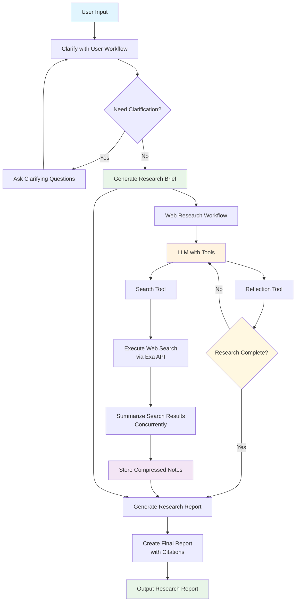

<div align="center">

# Deep Research

**AI-powered research assistant built with Go**

</div>

## Overview

Deep Research is an agentic AI research assistant that automates the process of gathering, analyzing, and synthesizing information from various sources.

This project serves as a learning process for me to pick up Go and extract key concepts and techniques from existing agentic AI research assistants and implement them in a way that is less framework-dependent (e.g., without using LangGraph).

## Features

- **Interactive Research Chat**: Natural language interface for research requests
- **Automated Workflows**: Multi-stage research process with clarification, brief generation, web research, and report creation
- **Web Search Integration**: Real-time web search capabilities for up-to-date information
- **Structured Output**: Organized research reports with proper citations and synthesis
- **Concurrent Processing**: Efficient parallel execution of research tasks

## Architecture

The application follows a clean architecture pattern with separation of concerns:

```
├── cmd/
│   └── main.go               # Application entry point
├── internal/
│   ├── config/           # Configuration management
│   ├── llm/              # Language model clients
│   ├── tools/            # Research tools (search, reflection)
│   └── workflows/        # Research workflow implementations
└── go.mod                # Go module dependencies
```

## Flowchart



## Quick Start

### Prerequisites

- Go 1.25 or later
- OpenAI API key
- EXA API key (for web search)

### Installation

1. Clone the repository:
```bash
git clone <repository-url>
cd go-deep-research
```

2. Install dependencies:
```bash
go mod tidy
```

3. Set up environment variables:
```bash
export OPENAI_API_KEY="your-openai-api-key"
export EXA_API_KEY="your-exa-api-key"
```

4. Run the application:
```bash
go run cmd/main.go
```

## Usage

1. **Start the Application**: Run `go run cmd/main.go` to launch the interactive research assistant
2. **Enter Your Research Request**: Type your research question or topic
3. **Clarification Phase**: The AI may ask questions to refine the research scope
4. **Research Execution**: The system will automatically:
   - Generate a research brief
   - Conduct web searches
   - Synthesize findings
   - Generate a comprehensive report

### Example Research Session

```
You: I need to research the latest developments in quantum computing for 2024

GPT: Information complete for quantum computing developments in 2024. 
     Will research recent breakthroughs, key players, and technological advances as requested.

[Research in progress...]

GPT: Here's your comprehensive research report on quantum computing developments in 2024:
     [Detailed research report with findings, citations, and analysis]
```

## Configuration

### Environment Variables

| Variable | Description | Default |
|----------|-------------|---------|
| `OPENAI_API_KEY` | OpenAI API key for language model access | Required |
| `EXA_API_KEY` | EXA API key for web search functionality | Required |

### Workflows

The application consists of four main workflows:

1. **Clarify with User**: Ensures research scope is well-defined
2. **Research Brief Generation**: Creates structured research plan
3. **Web Research**: Conducts searches and gathers information
4. **Research Report Generation**: Synthesizes findings into comprehensive report

## Development

### Project Structure

- **`cmd/main.go`**: Application entry point with graceful shutdown
- **`internal/config/`**: Configuration management and validation
- **`internal/llm/`**: Language model client initialization
- **`internal/tools/`**: Research tools (search, reflection utilities)
- **`internal/workflows/`**: Research workflow implementations

### Running Tests [WIP]

```bash
go test ./...
```

### Code Quality

```bash
go vet ./...       # Static analysis
gofmt -w .         # Format code
```

## Dependencies

- **[go-openai](https://github.com/sashabaranov/go-openai)**: OpenAI API client
- **[instructor-go](https://github.com/instructor-ai/instructor-go)**: Structured output generation
- **[jsonschema](https://github.com/invopop/jsonschema)**: JSON schema generation
- **Standard library packages**: context, log/slog, template, etc.

## License

This project is licensed under the MIT License.

## Todos

- [ ] Improve code quality
- [ ] Refactor code for better readability and maintainability
- [ ] Add documentation
- [ ] Add tests
- [ ] Create web server

---

**Built with ❤️ using Go and AI**
